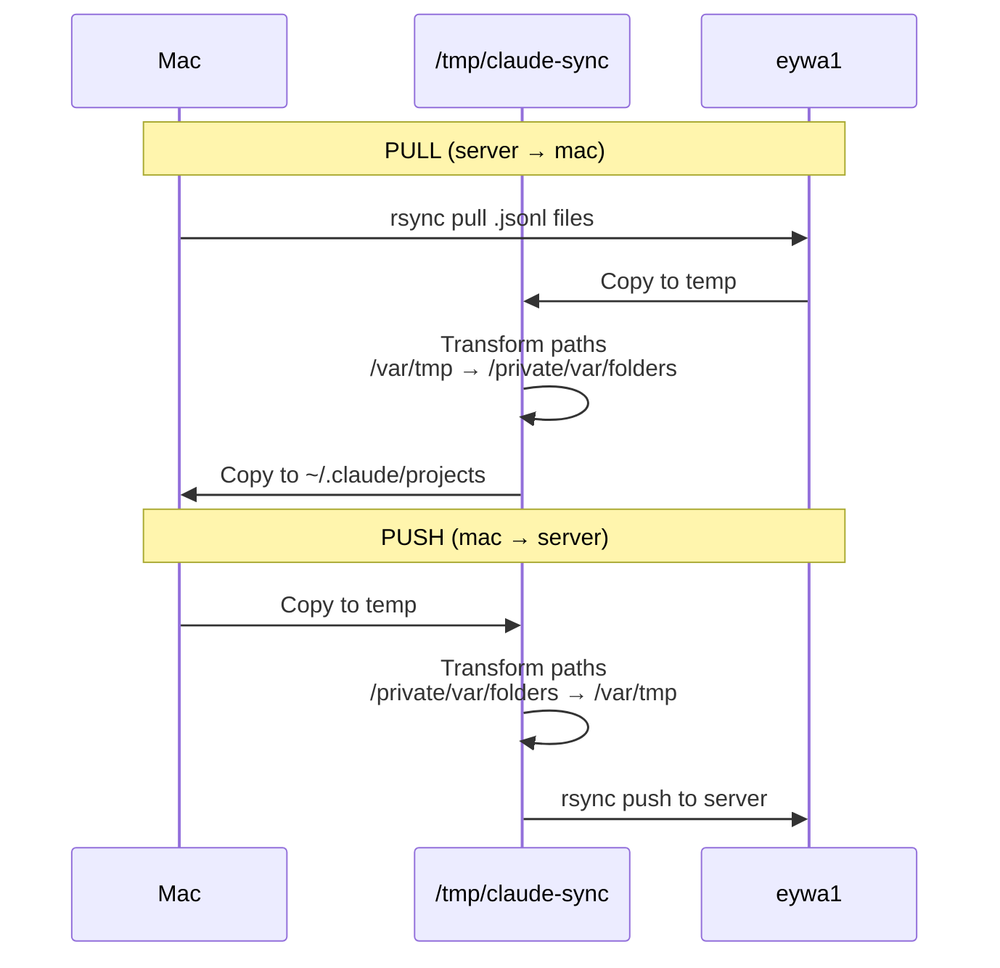

# Claude Code Server Sync

🔄 Синхронизация `.jsonl` сессий между Claude Code на сервере и macOS с автоматической трансформацией путей.

## 🎯 JTBD (Jobs to be Done)

| Job | Solution |
|-----|----------|
| Продолжить серверную сессию локально | `sync.py pull <project>` |
| Изучить сессии через cprompts/IDE | Автоматическая синхронизация раз в 5 мин |
| Запушить локальную работу на сервер | `sync.py push <project>` (manual approve) |

## ⚡ Quick Start

### 1️⃣ Prerequisite: SSH Setup

Убедись что работает SSH alias к серверу:

```bash
ssh eywa1 "echo Connection OK"
```

Если нет - добавь в `~/.ssh/config`:

```
Host eywa1
    HostName your.server.ip
    User user
    IdentityFile ~/.ssh/id_rsa
```

### 2️⃣ Configure Projects

```bash
# Copy example config
cp config.example.json config.json

# Edit mappings
vim config.json
```

**Config structure:**

```json
{
  "ssh_alias": "eywa1",
  "paths": {
    "server": {
      "claude_projects": "/home/user/.claude/projects",
      "temp_base": "/var/tmp",
      "temp_escaped": "-var-tmp"
    },
    "macos": {
      "claude_projects": "/Users/user/.claude/projects",
      "temp_base": "/private/var/folders/dw/.../T",
      "temp_escaped": "-private-var-folders-dw-...-T"
    }
  },
  "projects": [
    {
      "name": "vibe-orchestrator",
      "server_dir": "-var-tmp-vibe-kanban-worktrees-vk-2bd7-run-orch-n",
      "macos_dir": "-private-var-folders-...-vk-2bd7-run-orch-n",
      "sync": "server-to-mac",
      "enabled": true
    }
  ]
}
```

### 3️⃣ Test Transformation

```bash
python3 sync.py test
```

Должен пройти roundtrip test ✅

### 4️⃣ Manual Sync

```bash
# List configured projects
python3 sync.py list

# Pull from server
python3 sync.py pull vibe-orchestrator

# Push to server (asks confirmation)
python3 sync.py push memory-monorepo
```

## 🤖 Automatic Sync (macOS LaunchAgent)

### Setup Scheduler

Create `~/Library/LaunchAgents/com.claude.sync.plist`:

```xml
<?xml version="1.0" encoding="UTF-8"?>
<!DOCTYPE plist PUBLIC "-//Apple//DTD PLIST 1.0//EN" "http://www.apple.com/DTDs/PropertyList-1.0.dtd">
<plist version="1.0">
<dict>
    <key>Label</key>
    <string>com.claude.sync</string>

    <key>ProgramArguments</key>
    <array>
        <string>/usr/bin/python3</string>
        <string>/Users/user/__Repositories/LLMs-claude-code-exporter/scripts/claude-code-sync/sync-all.sh</string>
    </array>

    <key>StartInterval</key>
    <integer>300</integer> <!-- 5 minutes -->

    <key>RunAtLoad</key>
    <true/>

    <key>StandardOutPath</key>
    <string>/Users/user/__Repositories/LLMs-claude-code-exporter/logs/claude-sync.log</string>

    <key>StandardErrorPath</key>
    <string>/Users/user/__Repositories/LLMs-claude-code-exporter/logs/claude-sync.error.log</string>
</dict>
</plist>
```

### Create sync-all.sh helper

```bash
#!/bin/bash
# Sync all server-to-mac projects automatically

cd "$(dirname "$0")"

python3 sync.py list | grep "server-to-mac" | awk '{print $2}' | while read project; do
    echo "Syncing $project..."
    python3 sync.py pull "$project"
done
```

```bash
chmod +x sync-all.sh
```

### Load LaunchAgent

```bash
# Load agent
launchctl load ~/Library/LaunchAgents/com.claude.sync.plist

# Check status
launchctl list | grep claude.sync

# View logs
tail -f ~/logs/claude-sync.log

# Unload (stop)
launchctl unload ~/Library/LaunchAgents/com.claude.sync.plist
```

## 🧪 How it Works



## 🔐 Security Model

**Mac = Orchestrator** — все команды идут с мака:
- ✅ Mac → Server (rsync with SSH key)
- ✅ Server → Mac (rsync with SSH key)
- ❌ Server НЕ имеет credentials для мака

**Manual Approve for Push:**
- `server-to-mac` проекты требуют подтверждения при push
- Только `bidirectional` проекты могут автоматически sync в обе стороны

## 📁 Path Transformation Examples

| Server (Ubuntu) | macOS |
|----------------|-------|
| `/var/tmp/vibe-kanban-worktrees-vk-123/` | `/private/var/folders/dw/.../T/vibe-kanban-worktrees-vk-123/` |
| `-var-tmp-vibe-kanban-...` | `-private-var-folders-dw-...-T-vibe-kanban-...` |
| `/home/user/.claude/projects/` | `/Users/user/.claude/projects/` |

## 🐛 Troubleshooting

### Test fails with paths not matching

Check your config.json paths - especially `temp_escaped` must exactly match Claude's project naming:

```bash
# List actual project names
ls ~/.claude/projects/ | grep private-var

# Update config to match
```

### rsync fails with permission denied

Check SSH key authentication:

```bash
ssh -v eywa1 "ls ~/.claude/projects"
```

### Paths still wrong after sync

Your config mappings might be incomplete. Add missing patterns to `paths` section.

## 📚 Files

| File | Purpose |
|------|---------|
| `config.json` | Your project mappings (gitignored) |
| `config.example.json` | Example configuration |
| `sync.py` | Main CLI tool |
| `test_sample.jsonl` | QA test file |
| `README.md` | This file |
| `sync-all.sh` | Helper for auto-sync |

## 🎨 Commands Reference

```bash
# Test transformation
python3 sync.py test

# List projects
python3 sync.py list

# Pull from server
python3 sync.py pull <project-name>

# Push to server (with approval)
python3 sync.py push <project-name>
```

## 💡 Tips

1. **First sync:** Always run `sync.py test` first to verify transformations
2. **Add new project:** Update `config.json`, run `sync.py list` to verify
3. **One-way sync:** Set `"sync": "server-to-mac"` for read-only projects
4. **Debug:** Check `/tmp/claude-sync/` for transformed files
5. **Logs:** Check `~/logs/claude-sync.log` for scheduled runs

---

**Made for ADHD brains** 🧠⚡ by @developerisnow
